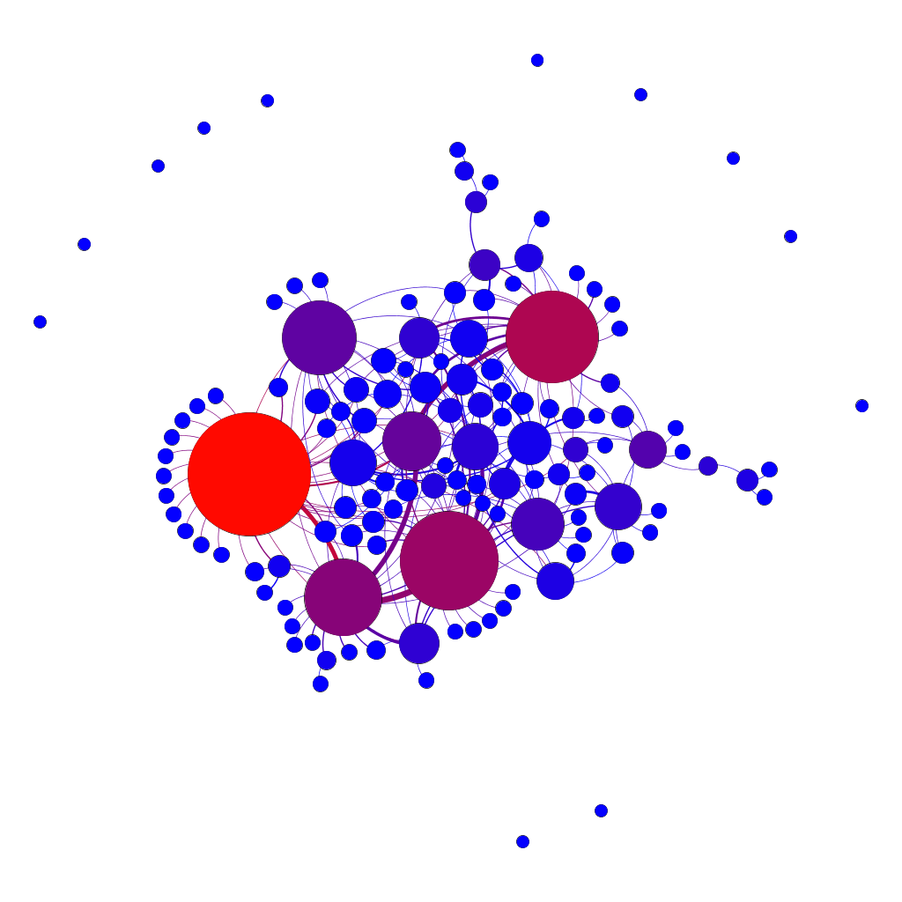
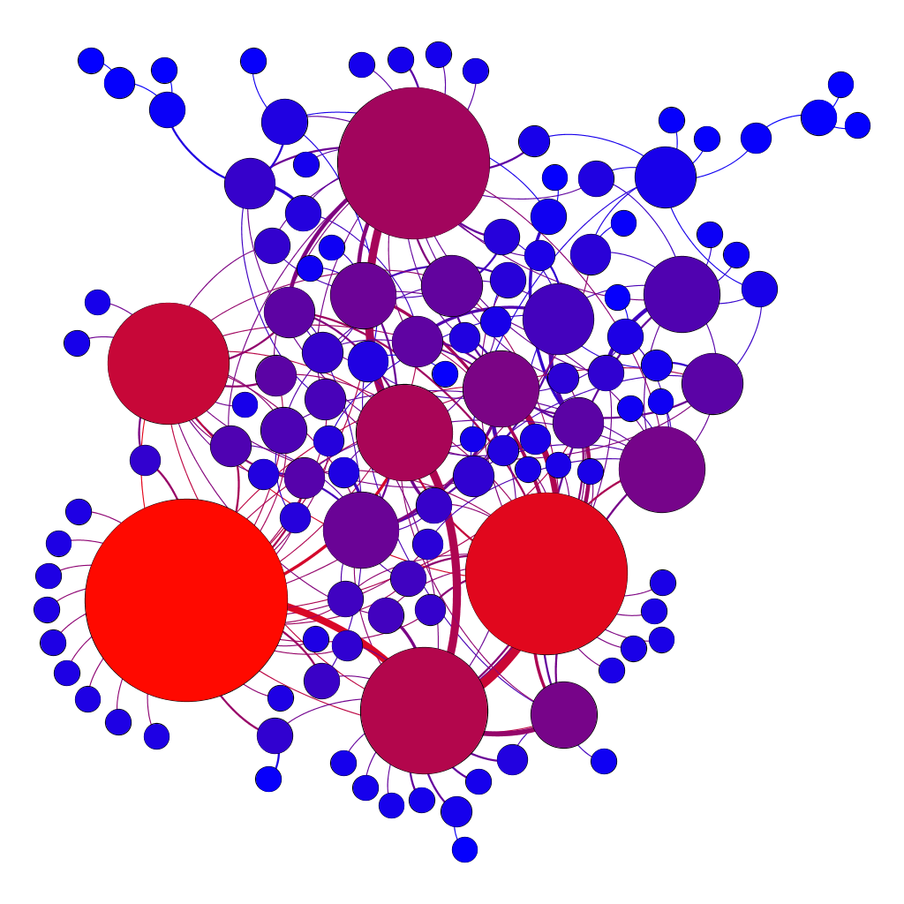
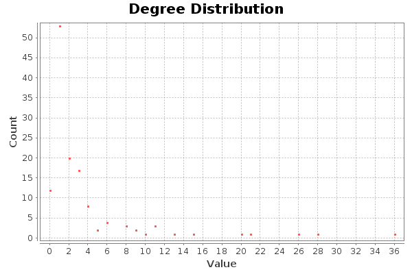
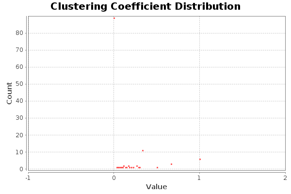
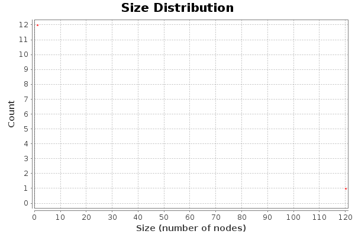

<!--Portada-->

# Práctica 1
# Análisis Preliminar y Visualización Básica de una Red Social de Facebook con Gephi
*****

### Gestión de Información en la Web
### Máster en Ingeniería Informática
### Curso 2016/17
### Universidad de Granada

> Nombre: Aythami Estévez Olivas
> DNI: 70918176E
> Email: <aythae@correo.ugr.es>

<!-- Salto de página -->

## Índice

<!--
Ejemplo de Indice final eliminando el enlace y añadiendo el número de página
- Apartado 1 2
-->

<!-- toc -->

- 1. Red social3
  * 1.1. Visualización de la red completa4
  * 1.2. Visualización de la componente gigante5
- 2. Cálculo de los valores de las medidas de análisis6
  * 2.1. Medidas globales de la red6
  * 2.2. Conectividad de la red8
- 3. Análisis de la red8
- 4. Conclusiones9

<!-- tocstop -->

<!-- Salto de página -->

## 1. Red social
Como se comenta en el guión de prácticas los cambios de privacidad en Facebook hacen que solo se puedan descargar datos sobre grupos o páginas públicas, esto restringe bastante las posibilidades. Tampoco tengo un elevado número de grupos en Facebook, por lo que decidí probar con un grupo de alquiler de pisos en granada. Este grupo tiene bastante actividad y cerca de 20.000 miembros, por este motivo a pesar de limitar el numero de post a unos 200 la aplicación NetVizz no ha sido capaz de generar los ficheros necesarios. Por esto me decidí a probar con un grupo más modesto, esta vez he decidido descargar los datos de un grupo del grado en ingeniería informática de la universidad de Salamanca (donde cursé mis estudios de grado). Este grupo cuenta con 273 miembros y un total de 131 mensajes desde su creación (29 de Septiembre del 2014). Dicho grupo se utiliza para la difusión de algunos eventos relacionados con la informática o para coordinar el cambio de grupo de prácticas, que en Salamanca se realiza por intercambio entre alumnos de dichos grupos.

Utilizando la herramienta NetVizz se obtienen varios ficheros, he utilizado aquel recomendado en las prácticas (`group_ID_Fecha_iteractions.gdf`). Dicho fichero representa una red social en el que los nodos son usuarios y los enlaces son interacciones entre estos, esta red es de tipo no dirigido.

<!-- Salto de página -->

### 1.1. Visualización de la red completa
En la siguiente imagen podemos ver la red completa donde el grosor del nodo representa el grado y su color un degradado de la intermediación, cuanto más rojo mayor intermediación tiene el nodo. destacan los nodos periféricos que no se encuentran conectados con ningún otro, por lo que son usuarios del grupo que no han tenido interacción alguna.

<!-- Salto de página -->

### 1.2. Visualización de la componente gigante
En la siguiente imagen podemos ver la componente gigante de la red donde el grosor del nodo representa el grado y su color un degradado de la centralidad de vector propio, cuanto más rojo mayor intermediación tiene el nodo.

<!-- Salto de página -->

## 2. Cálculo de los valores de las medidas de análisis

### 2.1. Medidas globales de la red

Medida                                        | Valor
----------------------------------------------|-------
Número de nodos (_N_)                         | 132
Número de aristas (_L_)                       | 227
Número de aristas máximo(_Lmax_)   | 8.731
Densidad (_D_)                                | 0,026
Grado medio (&lt;_k_&gt;)                     | 3,439
Diámetro (_dmax_)                  | 9
Distancia media (&lt;_d_&gt;)                 | 3,1893
Coeficiente de clustering medio (&lt;_C_&gt;) | 0,229

En la siguiente gráfica se aprecia la distribución de grados.

<!-- Salto de página -->

Aquí se muestra la distribución de la intermediación.

Y por último en esta gráfica se muestra la distribución del coeficiente de clustering.

<!-- Salto de página -->

### 2.2. Conectividad de la red

Medida                                                                     | Valor
---------------------------------------------------------------------------|-------------
Número de componentes conexas                                              | 13
Número de nodos de la componente gigante (% Respecto a la red total)   | 120 (90,91%)
Número de enlaces de la componente gigante (% Respecto a la red total) | 227 (100%)

La siguiente figura muestra la distribución de número y tamaño de las distintas componentes conexas.

## 3. Análisis de la red
Observando la distribución de grados de la red social creada se puede observar como sigue la distribución de larga estela típica de las redes sociales libres de escala, también se puede ver que a pesar de que el grado media sea de 3,439 cerca de 90 nodos (de 132) tiene 3 o menos interacciones con los demás. Si a esto le sumamos que la distancia media es de 3,1893, lo que es bastante menor que la distancia media típica de una red equivalente aleatoria e indica que esta es una red de mundo pequeño, además de que el coeficiente de clustering obtenido es algo mayor que el esperado en una red aleatoria.

También es destacable la distribución de las componentes conexas, hat un total de 12 formadas por un único miembro y 1 con el resto. Este tipo de fragmentación es común en redes reales.

Todos estos factores me llevan a concluir que esta es una red libre de escala como lo son las redes reales habituales.

## 4. Conclusiones
Como se puede apreciar del análisis llevado a cabo en este documento, a pesar de este grupo de Facebook sea muy poco activo se aprecian características típicas de una red social. El hecho de que sea tan poco activo, unido a que en dicho grupo se encuentran alumnos de diversas promociones por lo que muchos no llegan a conocerse, seguramente sea la razón por la que el coeficiente de clustering no es excesivamente elevado (aunque sí mayor que en el caso aleatorio).

Es una pena que no se pueda llevar a cabo este análisis sobre una red de miembros conocidos, como sería con nuestra propia red de amigos, ya que esto nos permitiría incorporar el conocimiento que tenemos de nuestros grupos sociales y ayudaría a reforzar los conceptos y conocimientos adquiridos con la práctica al poder sentirla más cercana por referirse a nuestros amigos.
