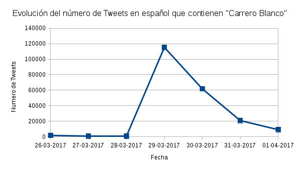
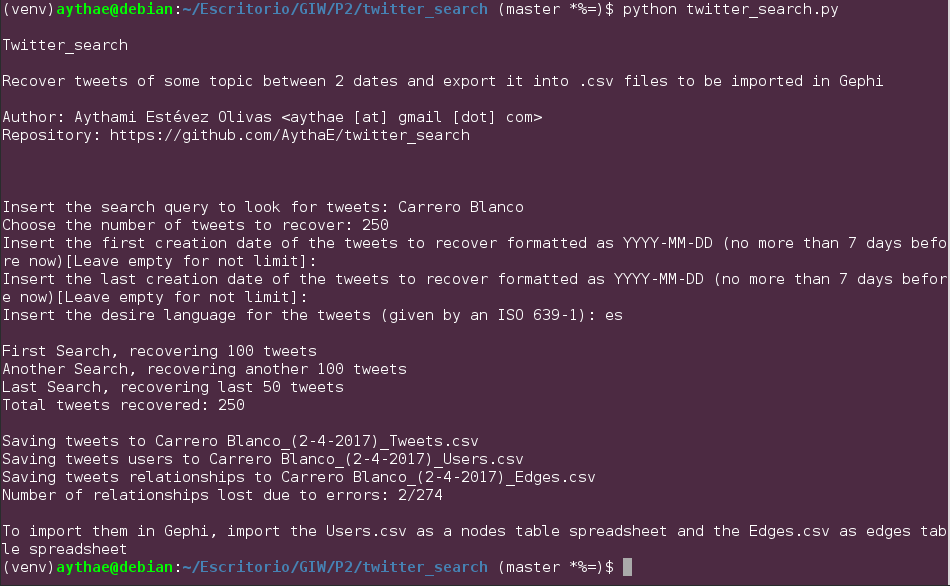

<!--Portada-->

<div class="portada">


# Práctica 2
# Caso Práctico de Análisis y Evaluación de Redes en Twitter
*****


<div class="portada-middle">

### Gestión de Información en la Web
### Máster en Ingeniería Informática
### Curso 2016/17
### Universidad de Granada

</div>
<div class="portada-down">

> Nombre: Aythami Estévez Olivas
> DNI: 70918176E
> Email: <aythae@correo.ugr.es>

</div>
</div>

<!-- Salto de página -->
<div style="page-break-before: always;"></div>

## Índice

<!--
Ejemplo de Indice final eliminando el enlace y añadiendo el número de página
- Apartado 1 <span style='float:right'>2</span>
-->

<!-- toc -->

- [1. Selección de un medio social, definición de una pregunta de investigación y obtención de un conjunto de datos asociado](#1-seleccion-de-un-medio-social-definicion-de-una-pregunta-de-investigacion-y-obtencion-de-un-conjunto-de-datos-asociado)
  * [1.1. Obtención y descripción de datos](#11-obtencion-y-descripcion-de-datos)
  * [1.2. Pregunta de investigación](#12-pregunta-de-investigacion)
- [2. Construcción de la red social on-line a analizar y visualizar](#2-construccion-de-la-red-social-on-line-a-analizar-y-visualizar)
  * [2.1. Importación de datos en Gephi](#21-importacion-de-datos-en-gephi)
  * [2.1. Reducción de la dimensionalidad de la red](#21-reduccion-de-la-dimensionalidad-de-la-red)
    + [2.1.1. Estrategias de poda Pathfinder](#211-estrategias-de-poda-pathfinder)
    + [2.1.2. Estrategias de filtrado](#212-estrategias-de-filtrado)
- [3. Cálculo de los valores de las medidas de análisis](#3-calculo-de-los-valores-de-las-medidas-de-analisis)
- [4. Determinación de las propiedades de la red](#4-determinacion-de-las-propiedades-de-la-red)
- [5. Calculo de los valores de las medidas de análisis de redes sociales](#5-calculo-de-los-valores-de-las-medidas-de-analisis-de-redes-sociales)
- [6. Descubrimiento de comunidades en la red](#6-descubrimiento-de-comunidades-en-la-red)
- [7. Visualización de la red social](#7-visualizacion-de-la-red-social)
- [8. Discusión de los resultados obtenidos](#8-discusion-de-los-resultados-obtenidos)
- [Anexo: twitter_search](#anexo-twitter_search)
  * [Tutorial](#tutorial)
  * [Uso del programa](#uso-del-programa)
- [Bibliografía](#bibliografia)

<!-- tocstop -->

<!-- Salto de página -->
<div style="page-break-before: always;"></div>

## 1. Selección de un medio social, definición de una pregunta de investigación y obtención de un conjunto de datos asociado
Estos últimos días se ha creado mucha polémica en España por la sentencia de la Audiencia Nacional el caso de los chistes de Carrero Blanco [[1]](#1) hechos por la tuitera Casandra Vera, los cuales le han llevado a una condena de 1 año de cárcel y 7 de inhabilitación. Me resulta un tema interesante como se pueden interpretar los límites de la libertad de expresión, la delgada linea entre el humor negro y el delito. Por ello he decidido estudiar este tema usando Twitter como medio social.

### 1.1. Obtención y descripción de datos
La obtención de datos de Twitter se ha realizado de un modo distinto del comentado en clase debido a problemas de compatibilidad de NodeXL con mi versión de Office, por ello decidí descargar tuits usando la API de Twitter mediante el módulo de python **Tweepy**[[2]](#2). He creado un script en python llamado `twitter_search.py` que utiliza Tweepy para descargar tuits a partir de una cadena de caracteres usada para la búsqueda, además permite especificar el número de tuits a recuperar, las fechas entre las que se han escrito los tuits devueltos, o el idioma de los tuits. Ver el apartado [Anexo: twitter_search](#anexo-twitter_search) para más información.

### 1.2. Pregunta de investigación
La pregunta concreta de investigación es **¿Cúales los usuarios más relevantes que han tuiteado usando la palabras "Carrero Blanco"?**

Es necesario acotar un poco más la pregunta de investigación, ya que no he determinado una ventana temporal para estudiar el tema, por ello empecé descargando todos los tuits que se habían escrito en distintos días para ver como evoluciona su repercusión a lo largo del tiempo y elegir el día más interesante para estudiarlo. Con estos datos he creado la siguiente gráfica que representa el número de tuits respecto a los días:



Como se puede apreciar se produce un importante incremento del número de Tweets que contienen "Carrero Blanco" el día **29 de Marzo** (llegando a 115.254 tuits), coincidiendo con la sentencia que condenaba a Casandra Vera por sus chistes. Por ello este será el día seleccionado para realizar el estudio.

## 2. Construcción de la red social on-line a analizar y visualizar
Como se ha dicho en el apartado [Anexo: twitter_search](#anexo-twitter_search) para responder esta pregunta construye una red social en la que los **nodos corresponden a los usuarios** que ha escrito tuits sobre el tema y los **arcos a las relaciones entre estos usuarios** a partir de las menciones y retuits que han realizado. El **peso** de estos determina el número de relaciones que unen a un usuario con otro y he optado por la construcción de un **grafo dirigido** de la forma que si el usuarioA menciona al usuarioB existirá un arco dirigido desde el usuarioA al usuarioB.

### 2.1. Importación de datos en Gephi
A la hora de importar los ficheros `.csv` generados a Gephi hay que seleccionar _Archivo_ > _Importar hoja de calculo_, aquí se pide un fichero, su separador, su codificación y su es tabla de nodos o aristas.

Primero importaremos los nodos (el fichero `queryX_(dateSince_dateUntil)_Users.csv`) para ello lo seleccionamos, dejamos como separador la coma, como codificación UTF-8 y marcamos que es una tabla de nodos. Al hacer click en siguiente se nos muestran las columnas a importar, es necesario cambiar los tipos de datos de las columnas Following, Followers, Tweets_count, Favourites a _Long_ para poder utilizarlos como números más adelante.

Una vez hecho esto pulsamos terminar y pasamos a importar las aristas, volvemos a seleccionar _Importar hoja de calculo_, buscamos el fichero `queryX_(dateSince_dateUntil)_Edges.csv`, marcamos que es una tabla de aristas dejando el resto tal cual y pulsamos siguiente. Es importante marcar el checkbox de **crear nodos inexistentes** ya que es posible que existan menciones a usuarios no existentes en el fichero de usuarios. Para crear los usuarios que no estén en el fichero de nodos Gephi crea nuevas filas en el fichero con todas las columnas vacías a excepción del ID que saca del fichero de relaciones, por ello para que al menos aparezca el label es necesario acceder al _Laboratorio de datos_ de Gephi y seleccionar la opción de copiar columna ID sobre la columna Label. Con esto podemos analizar la red social mejor al tener no solo los usuarios que han escrito tuits, si no aquellos que han sido mencionados o retuiteados en estos tuits, como inconveniente es que de esos usuarios generados por Gephi solo poseemos su ID y Label, no sus datos de twitter como el número de seguidores, por ello habrá que tener precaución al usar estas medidas en el análisis ya que existen valores perdidos.


### 2.1. Reducción de la dimensionalidad de la red
Usando los tweets del día 29 de marzo se obtiene un total de 49.640 usuarios (nodos) y 107.365 relaciones (aristas), cabe mencionar que al importar a Gephi las aristas se marca la opción de _Crear nodos inexistentes_ y el número de nodos crece hasta los 50.258.

Como resulta obvio parándose a mirar los números de nodos y aristas del grafo no resulta manejable trabajar con un grafo de estas dimensiones, por lo que hay que reducir su dimensión. Teniendo en cuenta que nos encontramos ante un grafo ponderado dirigido ponderado se puede reducir la dimensión aplicando un filtrado de nodos por grado o de aristas por peso o bien una poda pathfinder.

#### 2.1.1. Estrategias de poda Pathfinder
La poda pathfinder sería lo mejor ya que conservan los enlaces más importantes de la red proporcionando una representación única de la estructura subyacente de la red. Por ello busque en los apuntes el mejor algoritmo pathfinder aplicable a mi red (teniendo en cuenta que existen múltiples versiones y actualizaciones), según estos el mejor algoritmo pathfinder es el **MST-Pathfinder** basado en un enfoque greedy logra ser mucho más rápido que sus hermanos a costa de restringir algunos parámetros, el problema es que solo es aplicable en grafos no dirigidos por lo que no es utilizable en mi caso.

Por tanto el siguiente candidato es **Fast Pathfinder**, partiendo de las referencias de los apuntes empecé mirando la una web que analiza las diversas variantes y aporta implementaciones en C de todas ellas [[4]](#4). El problema es que la implementación en C del algoritmo Fast pathfinder esta hecha para grafos no dirigidos pero dicha web menciona otras implementaciones conocidas, así es como dí con **Network Workbench** (NWB) [[5]](#5), una herramienta software para el análisis de redes a gran escala que contiene multiples implementaciones de diversos algoritmos útiles para este análisis, entre ellas las diversas podas Pathfinder. A pesar de lo prometedor que suena esto he tenido múltiples problemas para usar esta herramienta, empezando por que parece estar abandonada (sin actualizaciones desde 2011), la documentación on-line no funciona pero logré obtener un manual de usuario en PDF [[6]](#6). Según esté, NWB admite diversos formatos entre los que se encuentra el formato .net de Pajek, por lo que exporté desde Gephi la red del grafo completo a ese formato obviando las posiciones de los nodos ya que solo me interesan sus relaciones para aplicar el podado. Tras cargar la red probé a realizar un Fast Pathfinder desde la opción _Analysis_ > _Directed and Pondered_ > _Fast pathfinder network_ obteniendo errores por ser la red demasiado grande y tener autoenlaces o bucles (enlaces de un nodo hacia si mismo, cosa muy habitual en una conversación en twitter ya que al responder a alguien se van acumulando las menciones a todos los participantes en la conversación). Por ello realice un pequeño podado en Gephi aplicando un filtro de _Componente gigante_ con un subfiltro _K-core_ que permite eliminar nodos con grado menor que _k_ (_k_ = 2) como se ha visto en la asignatura, pero además aplicando un subfiltro de bucles. Exportando el resultado a .net y cargandolo en NWB esta vez no se produce error, pero tras una hora y media de ejecución no se llega a ningún resultado, debido a las dimensiones de la red a pesar de la reducción (20.165 vértices y 79.962 enlaces) y a la eficiencia del algoritmo que según [[4]](#4) obtiene tiempos de más de una hora para una red de 10.000 nodos y 100.000.000 de enlaces. Hice una última prueba con NWB y la red mucho más podada, con un _K-core_ de _k_ = 12 lo que da una red de 922 nodos y 13.700 enlaces. Por mera curiosidad de ver como quedaba mi red podada con pathfinder llegado a este punto. Esta vez el algoritmo si que acaba en unos segundos pero se produce un error interno haciendo un conversión a double, por lo que me quedé con las ganas de ver el algoritmo funcionando.

<br/><br/>
#### 2.1.2. Estrategias de filtrado
Resignado tras los frustrados intentos con pathfinder me decanté por aplicar filtrados. Lo primero que parece lógico, teniendo en cuenta que es una red de usuarios de Twitter, es filtrar por el número de seguidores de usuarios como una forma de conocer su relevancia general. Pero con la creación de nodos inexistentes a partir de las relaciones los usuarios creados no disponen  de esos datos por lo que en lugar de eso he decidido filtrar por grado de los nodos y por peso de las aristas. Esto se realiza con los filtros de Gephi **_K-core_** de la categoría _Topología_ y **_Peso de arista_** de la categoría _Aristas_ respectivamente. Además de esto he probado con el filtro **_Componente gigante_** de la categoría _Topología_ que se basa en mantener solamente nodos del componente conectado mayoritario, ya que lo hemos utilizado en clase como primer filtro.

El objetivo es llegar a una red manejable entorno a los 1000-2000 nodos. En la siguiente tabla se recoge el resultado de diversos filtrados

Estrategia de filtrado                                   | Numero de Nodos | Número de enlaces | % Nodos respecto a la red sin filtrar | % Enlaces respecto a al red sin filtrar
---------------------------------------------------------|-----------------|-------------------|---------------------------------------|----------------------------------------
Ninguna                                                  | 50.258          | 107.365           | -                                     | -
Componente gigante                                       | 46.843          | 106.818           | 93,21                                 | 99,49
K-core (k = 2)                                           | 20.264          | 80.280            | 40,32                                 | 74,77
K-core (k = 3)                                           | 11.443          | 62.853            | 22,77                                 | 58,54
Peso de arista > 1                                       | 50.258          | 5.864             | 100                                   | 5,46
Componente gigante + K-core (k = 2)                      | 20.188          | 80.187            | 44,17                                 | 74,69
Componente gigante + K-core (k = 3)                      | 11.431          | 62.830            | 22,74                                 | 58,52
Componente gigante + K-core (k = 10)                     | 1.421           | 18.899            | 2,83                                  | 17,6
Componente gigante + K-core (k = 2) + Peso de arista > 1 | 1.003           | 2.805             | 2                                     | 2,61

Como se puede ver el filtrado _K-core_ por si solo no elimina los suficientes enlaces para que la red sea manejable, a la inversa le pasa al filtro _Peso de arista_. La mejor solución por tanto parece la combinación de estos dos filtros como se ve en la última fila de la tabla.

## 3. Cálculo de los valores de las medidas de análisis

## 4. Determinación de las propiedades de la red

## 5. Calculo de los valores de las medidas de análisis de redes sociales

## 6. Descubrimiento de comunidades en la red

## 7. Visualización de la red social

## 8. Discusión de los resultados obtenidos


## Anexo: twitter_search
**Twitter_search** es un programa en Python para recuperar tuits que contengan ciertas palabras o hashtags y exportarlos en ficheros `.csv`, permite seleccionar las fechas entre las que buscar los tuits, el número de tuits a recuperar y el idioma de los tuits. Usa el módulo Tweepy [[2]](#2) para manejar las llamadas a la API de Twitter.

Tras descargar los tuits genera tres ficheros `.csv`:
- `queryX_(dateSince_dateUntil)_Tweets.csv`: Contiene los siguientes campos
    - "ID": Identificador del tuit usado por Twitter.
    - "User": Nombre del usuario que escribió el tweet, este corresponde al "screen_name" devuelto por la API, es decir al @usuario.
    - "Created_at": Fecha y hora de creación del tuit.
    - "Tweet": Texto del tuit en sí.
    - "Following": Número de personas a las que sigue este usuario.
    - "Followers": Número de personas que siguen a este usuario.
    - "Tweets_count": Número de tweets escritos por este usuario.
    - "Favourites": Número de me gustas de este usuario.
    - "Time_Zone": Zona horaria del usuario.
    - "Location": Localización del usuario (si la tiene puesta en su perfil).
- `queryX_(dateSince_dateUntil)_Users.csv`: Contiene el ID y Label de los nodos que corresponden al nombre de usuario (@usuario) además de los mismos datos del usuario que el fichero previo (Following, Followers, Tweets_count, Favourites, Time_Zone y Location) pero con una sola entrada por cada usuario, en el caso previo si un mismo usuario ha escrito varios tuits aparecerá varias veces en el fichero. Está preparádo para ser importado en [Gephi](https://gephi.org/) como una hoja de cálculo, en concreto como **tabla de nodos**.
- `queryX_(dateSince_dateUntil)_Edges.csv`: Contiene las relaciones de los tuits descargados, es decir menciones a usuarios y retuits.  Está preparádo para ser importado en [Gephi](https://gephi.org/) como una hoja de cálculo, en concreto como **tabla de aristas**.

Para usar este programa es necesario registrar una aplicación en Twitter para obtener los credenciales necesarios para consultar la API, una vez obtenidos hay que copiarlos como cadenas de caracteres en el fichero [`credentials.py`](credentials.py).

### Tutorial
Para obtener una descripción detallada de los pasos a realizar para utilizar este programa se puede seguir el siguiente tutorial que también utiliza Tweepy para descargar datos de Twitter y utilizarlos en Gephi [[3]](#3).

### Uso del programa
Es necesario instalar Python 3 y `virtualenv` antes de usar este programa, una vez hecho esto se pueden instalar el resto de dependencias ejecutando los siguientes comandos (los comandos han sido probados en una máquina Debian, pueden ser diferentes en su S.O.):

```
virtualenv -p$(which python3) venv
source venv/bin/activate
pip install -r requirements.txt
```

Y para ejecutar el script hay que introducir el siguiente comando:

```
python twitter_search.py
```




<!-- Salto de página -->
<div style="page-break-before: always;"></div>

## Bibliografía

<p id="1">

[1]: La Audiencia Nacional condena a un año de cárcel a Cassandra por los tuits sobre Carrero Blanco (n.d). Recuperado el 1 de Abril de 2017, desde <http://www.eldiario.es/politica/Audiencia-Nacional-condena-tuitera-Cassandra_0_627487833.html>

</p>

<p id="2">

[2]: Tweepy: Twitter for Python! (n.d). Recuperado el 1 de Abril de 2017, desde <https://github.com/tweepy/tweepy>

</p>

<p id="3">

[3]: Maths with Python 6: Twitter API – Tweepy for social media and networks (with Gephi) (n.d). Recuperado el 2 de Abril de 2017, desde <https://thebrickinthesky.wordpress.com/2014/06/26/maths-with-python-6-twitter-api-tweepy-for-social-media-and-networks-with-gephi/>

</p>

<p id="4">

[4]: A. Quirin (2014). The Pathfinder algorithm: the original, binary, Fast and MST-variants. Recuperado el 3 de Abril de 2017, desde <http://aquirin.ovh.org/research/mstpathfinder.html>

</p>

<p id="5">

[5]: Network Workbench: A Workbench for Network Scientists (n.d). Recuperado el 3 de Abril de 2017, desde <http://nwb.cns.iu.edu/index.html>

</p>

<p id="6">

[6]: Network Workbench Tool User Manual 1.0.0. (2009). Recuperado el 3 de Abril de 2017, desde <http://nwb.cns.iu.edu/Docs/NWBTool-Manual.pdf>

</p>
<!--
Ejemplo de formato de cita para un articulo
P. Cortez & A. Silva. (2008). Using Data Mining to Predict Secondary School Student Performance.
In A. Brito and J. Teixeira Eds., Proceedings of 5th FUture BUsiness TEChnology Conference
(FUBUTEC 2008) pp. 5-12, Porto, Portugal, EUROSIS, ISBN 978-9077381-39-7.
-->
