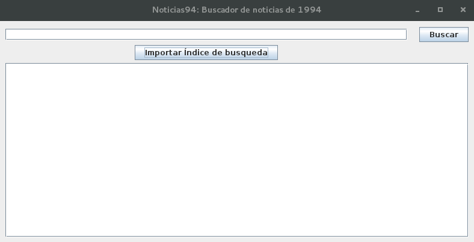
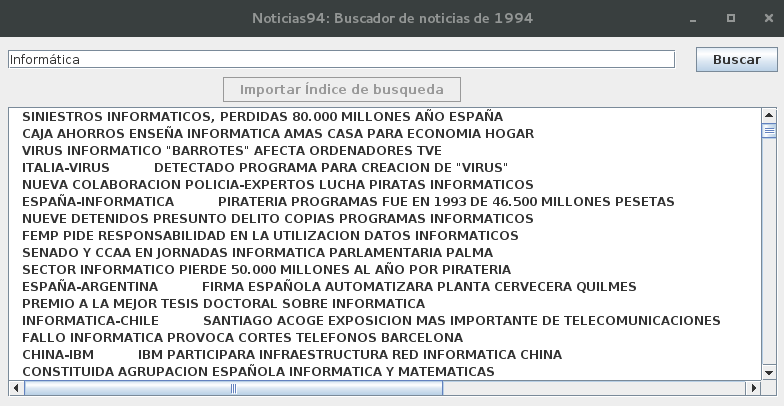

<!--Portada-->

<div class="portada">


# Práctica 3
## Desarrollo de un Sistema de Recuperación de Información con Lucene


<div class="portada-imgs">


</div>

<div class="portada-middle">

### Gestión de Información en la Web
### Máster en Ingeniería Informática
### Curso 2016/17
### Universidad de Granada

</div>

<div class="portada-down">

> Nombre: Aythami Estévez Olivas
> DNI: 70918176E
> Email: <aythae@correo.ugr.es>

</div>

</div>

<!-- Salto de página -->
<div style="page-break-before: always;"></div>

## Índice

<!--
Ejemplo de Indice final eliminando el enlace y añadiendo el número de página
- Apartado 1 <span style='float:right'>2</span>
-->

<!-- toc -->

- [1. Enunciado](#1-enunciado)
- [2. Descripción de la práctica](#2-descripcion-de-la-practica)
  * [2.1. Indexador](#21-indexador)
  * [2.2. Buscador](#22-buscador)
- [3. Manual de usuario](#3-manual-de-usuario)
  * [3.1. Indexer.jar](#31-indexerjar)
  * [3.2. GUI_Searcher.jar](#32-gui_searcherjar)
- [4. Conclusiones](#4-conclusiones)
- [Bibliografía](#bibliografia)

<!-- tocstop -->

<!-- Salto de página -->
<div style="page-break-before: always;"></div>

## 1. Enunciado
Los objetivos de esta práctica son:
1. Conocer las partes principales que tiene un sistema de recuperación de
información y qué funcionalidad tiene cada una.
2. Implementar un sistema de recuperación de información.
3. Emplear la biblioteca [Lucene](https://lucene.apache.org/) para facilitar dicha implementación.

## 2. Descripción de la práctica
Tal y como se índica en el guión de la práctica se han desarrollado dos programas separados, uno para el **indexador** y otro par el **buscador** en sí mismo. He decidido desarrollar ambos usando el lenguaje de programación **Java** ya que es el lenguaje nativo de Lucene y que es uno de los lenguajes en los que me siento más cómodo debido a mi experiencia con el mismo. Como entorno de desarrollo o IDE he decidido utilizar [**IntelliJ IDEA**](https://www.jetbrains.com/idea/) debido a qué probé con [Eclipse](https://www.eclipse.org/) pero me dío diversos problemas con el heap de Java que IntelliJ IDEA no, tambíen me he decantado por este por sus utilidades integradas para la creación de interfaces gŕaficas de usuario o GUI que facilitan mucho dicha tarea, lo cual me ha venido bien teniendo en cuenta que nunca había creado una aplicación en Java con interfaz de usuario.

Respecto a Lucene he utilizado la versión **4.3.0** comentada en el guión de la práctica, la cual se encuentra disponible para su descarga en el siguiente [enlace](http://archive.apache.org/dist/lucene/java/4.3.0/). No es necesario importar todas las utilidades que aparecen en dicha versión, son necesarios tres `.jar`:
- `lucene-analyzers-common-4.3.0.jar`: que contiene el código necesario para los analizadores encargados de realizar toda la gestión de tokens del texto original, en concreto he utilizado `SpanishAnalyzer`.
- `lucene-core-4.3.0.jar`: que contiene las funciones principales de la librería.
- `lucene-queryparser-4.3.0.jar`: utilizado para poder parsear las consultas sobre el índice.

A continuación pasaré a comentar los programas creados.

### 2.1. Indexador
La tarea de este programa es indexar los documentos que contiene la colección de noticias de la agencia EFE de 1994. Dicha colección está formada por ficheros en formato SGML, uno por cada día del año siguiendo el formato `1994MMDD.sgml`, en los cuales se incluyen noticias con diversos campos. Para la realización de esta práctica solo he utilizado los campos `TITLE` (que contiene el título de la noticia) y `TEXT`(que representa el contenido de la noticia). Según dicta el enunciado no es necesario que este programa tenga interfaz gráfica, por ello he creado un ejecutable desde terminal que recibe como argumentos:
- La ruta al directorio que contenga la colección EFE.
- La ruta a un fichero de palabras vacías que ayuda a descartar información y a mejorar el proceso de indexación.
- La ruta de salida donde se almacenará el índice creado.

Lo primero que hay que realizar para indexar los ficheros es **leerlos**, esto puede parece trivial pero al encontrarnos ante un formato de texto estructurado [1] lo recomendable es utilizar un "parser" que nos permita acceder a los campos con facilidad sin necesidad de leer el fichero en formato textual e ir buscando manualmente el contenido que nos interesa utilizando expresiones regulares o técnicas similares. No he sido capaz de encontrar ningún parser directo entre SGML y Java, probablemente debido a la antigüedad de SGML (primeras versiones en 1986) y a la aparición de otros lenguajes de marcado más modernos y extendidos como HTML o XML. Por ello he utilizado el parser **DOM** de la W3C [2] integrado en Java desde su versión 1.4, este parser esta pensado para ser general y funcionar con diversos lenguajes de marcado, como pegas tiene que parece ser uno de los peores en términos de rendimiento comparándolo con otros más modernos como SAX o StaX [3]. Para mi implementación me he guiado por las recomendaciones dadas en [4].

El primer problema a resolver tiene que ver con las **codificaciones** de texto, los ficheros de la colección efe se encuentran en una codificación extraña, ISO 646-1983, la cual ni he encontrado en Java, y el parser DOM espera UTF-8, por ello he leído los ficheros en formato textual utilizando la codificación latina ISO-8859-1 que permite realizar un apaño aunque algunos caráteres especiales como acentos o ñ se pierdan por el camino. Una vez leído un fichero como un `String` se lo paso al parser en formato UTF-8 y surgen otro problema causado porque el documento no tiene un **elemento raíz** del que dependan el resto, por ello añado las etiquetas `<SGML>` y `</SGML>` al principio y final del `String` leído antes de pasarlo al parser. Con esto ya empieza a funcionar, pero existen algunas noticias con **carácteres especiales** que el parser no entiende y no es capaz de leer. En la siguiente tabla detallo los caracteres que me han dado problemas y su sustitución:

Carácter problemático | Sustitución
----------------------|------------
"&"                   | ""
"< "                  | " "
"<\n<"                | "\n<"
";<"                  | ";"

En este punto tengo que comentar la ayuda de mi compañero Francisco Javier Bolívar Lupiáñez para encontrar estos carácteres problemáticos. Tras realizar esta tarea ya se pueden leer todos los documentos de forma correcta, con la excepción de algunos carácteres perdidos como ya he comentado. Por último mencionar que este trabajo de parseo se ha realizado en la clase **`es.ugr.giw.p3.indexer.SGMLParser`**.

Con el objetivo de actuar como modelo del sistema he creado la clase **`es.ugr.giw.p3.common.News`**, esta contiene los atributos que usaré de las noticias, el título y su contenido.

La clase más destacada de este programa es **`es.ugr.giw.p3.indexer.Indexer`** ya que es donde se lleva a cabo realmente el proceso de indexación. Esta se encarga de invocar los métodos de la clase SGMLParser para leer los ficheros recibiendo una `List<News>` como salida. Con esta estructura de datos realiza el proceso de indexación.

Para finalizar este apartado mencionar que toda la salida por por consola se ha gestionado con la clase **`Logger`** de Java siguiendo los consejos de [5]. He dejado el nivel de logging establecido en INFO, pero sería posible aumentar la verbosidad de la salida permitiendo todos los niveles (nivel ALL). Para hacer esto basta con cambiar el valor del atributo `logLvl` de la clase `Indexer`.

### 2.2. Buscador
Una vez creado el índice he creado un programa para consultarlo y realizar búsquedas sobre este, como ya he dicho ha de tener GUI, la cual ha sido creada con el el **GUI Designer** integrado en IntelliJ IDEA [6]. La interfaz generada es muy simple ya que el objetivo es poder ilustrar como funciona un sistema de búsqueda, no crear una aplicación con un diseño ergonómico. En el apartado 3. Manual de usuario entraré más en detalle sobre esta interfaz con capturas de pantalla y explicación de sus funcionalidades.

En este apartado me centraré en la parte funcional de la aplicación, el motor tras la GUI, la búsqueda en sí. Este proceso se lleva a cabo en la clase **`es.ugr.giw.p3.searcher.Searcher`** cuando el usuario pulsa buscar en la interfaz gráfica. Esta clase formada de métodos estáticos se encarga de abrir el índice (cuya ruta indica el usuario en la GUI) almacenando las estructuras para su acceso en atributos estáticos lo que hace necesario cargarlo solo en la primera búsqueda, con ello se consigue que las sucesivas búsquedas sean más rápidas ya que solo hay que crear la consulta y recuperar los resultados. Además de esto contiene un método para cerrar el índice invocado cuando se produce un error al cargarlo (por no indicarle un directorio que no contenga un índice) o al cerrar el buscador. También comentar que se han limitado los resultados devueltos para una búsqueda a 1000.

La GUI se divide en 2 clases:
- **`es.ugr.giw.p3.searcher.GUI_Searcher`**: Interfáz del buscador en sí, es encargada de inicializar los elementos gráficos de su ventana así como contener los manejadores de eventos sobre estos. Permite cargar un índice, lanzar consultas sobre el y mostrar un listado de resultados devueltos.
- **`es.ugr.giw.p3.searcher.GUI_News`**: Interfaz que muestra una noticia en detalle, se lanza como una ventana separada al seleccionar una noticia del listado de resultados y nos muestra su título y contenido.

## 3. Manual de usuario
Ahora describiré la utilización de los programas creados. Teniendo en cuenta que han sido creados en Java es necesario tener instalada la máquina virtual de Java o JRE en su versión 8.

### 3.1. Indexer.jar
Como ya he dicho es una utilidad de consola, para ejecutarla basta con ejecutar:
```
java -jar Indexer.jar <Ruta al directorio de la coleccción> <Ruta fichero de palabras vacías> <Ruta al directorio donde alojar los índices>
```
Una vez indicado eso el programa empieza a ejecutarse y va indicando las acciones que va realizando, en el siguiente bloque vemos un ejemplo de la salida por pantalla de una ejecución correcta:
```
may 04, 2017 11:35:09 AM es.ugr.giw.p3.indexer.SGMLParser parseNews
INFORMACIÓN: Leyendo noticias...
may 04, 2017 11:35:38 AM es.ugr.giw.p3.indexer.SGMLParser parseNews
INFORMACIÓN: Noticias leídas: 215.738
may 04, 2017 11:35:39 AM es.ugr.giw.p3.indexer.Indexer index
INFORMACIÓN: Creando el analizador...
may 04, 2017 11:35:39 AM es.ugr.giw.p3.indexer.Indexer index
INFORMACIÓN: Creando el IndexWriter...
may 04, 2017 11:35:39 AM es.ugr.giw.p3.indexer.Indexer index
INFORMACIÓN: Escribiendo el índice...
may 04, 2017 11:36:15 AM es.ugr.giw.p3.indexer.Indexer index
INFORMACIÓN: Todas las noticias indexadas correctamente
may 04, 2017 11:36:20 AM es.ugr.giw.p3.indexer.Indexer closeIndex
INFORMACIÓN: Saliendo...
```

### 3.2. GUI_Searcher.jar
Para lanzar este programa se puede ejecutar directamente con la JRE, pero se recomienda ejecutarlo desde terminal para poder ver el log del programa que aporta más información sobre las tareas realizadas. La ejecución desde terminal se lleva a cabo con:
```
java -jar GUI_Searcher.jar
```

En la siguiente imagen se puede apreciar el aspecto de la aplicación, como se aprecia es una interfaz muy minimalista que posee 2 botones para importar un índice y buscar; un cuadro de texto para la introducción de consultas y un cuadro para mostrar los resultados. También muestra diversos diálogos de información o error para guiar al usuario en su utilización.



Una vez que importamos un índice dicho botón se deshabilita y se pueden realizar búsquedas introduciendo algo en el cuadro de búsqueda y pulsando el botón de buscar o pulsando la tecla ENTER con el foco en dicho cuadro. En la siguiente imagen vemos un ejemplo de búsqueda



Si seleccionamos alguna de las noticias devueltas en la búsqueda haciendo click sobre ella podemos ver su detalle en una ventana separa como la siguiente


## 4. Conclusiones
Como se puede ver durante el desarrollo de esta práctica se han ido cumpliendo los objetivos establecidos en el apartado 1. Enunciado. Me ha llamado especialmente la atención lo rápido y sencillo que resulta montar un sistema de búsqueda usando la librería Lucene, se puede montar un sistema básico en apenas una tarde. También mencionar que prácticamente la parte de la práctica que más trabajo se ha llevado ha sido leer los ficheros SGML a pesar de que esto no está relacionado con los objetivos de la práctica en sí, en próximas prácticas sería más interesante utilizar una colección en otro formato como XML o JSON ya que quitaría muchos problemas y permitiría centrarse en lo verdaderamente importante que es construir un sistema de búsqueda.

<!-- Salto de página -->
<div style="page-break-before: always;"></div>

## Bibliografía


<p id="1">

[1]: SGML (n.d). Recuperado en Mayo de 2017, desde <https://en.wikipedia.org/wiki/Standard_Generalized_Markup_Language>

</p>

<p id="2">

[2]: Document Object Model (DOM) (n.d). Recuperado en Mayo de 2017, desde <https://www.w3.org/DOM/>

</p>

<p id="3">

[3]: Java and XML (n.d). Recuperado en Mayo de 2017, desde <http://www.vogella.com/tutorials/JavaXML/article.html#javaxml>

</p>

<p id="4">

[4]: How to read XML file in Java – (DOM Parser) (n.d). Recuperado en Mayo de 2017, desde <http://www.mkyong.com/java/how-to-read-xml-file-in-java-dom-parser/>

</p>

<p id="5">

[5]: Java Logging API - Tutorial (n.d). Recuperado en Mayo de 2017, desde <http://www.vogella.com/tutorials/Logging/article.html>

</p>

<p id="6">

[6]: Designing GUI. Major Steps (n.d). Recuperado en Mayo de 2017, desde <https://www.jetbrains.com/help/idea/2017.1/designing-gui-major-steps.html>

</p>
